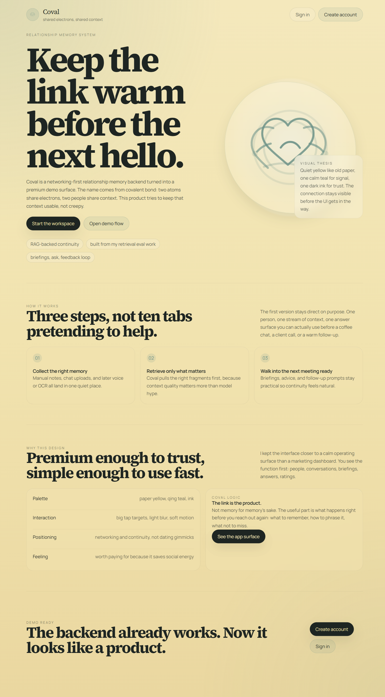

# Coval

[](https://github.com/JYins/coval/actions/workflows/ci.yml)

Coval is an AI-powered relationship memory backend I am building step by step. The idea is a bit unusual, I know, but I think there is a real use case here for dating, sales, and active networking: if we can retrieve the right personal context at the right time, maybe we can show up a little better in real conversations. This repo is still backend-first at the core, but it now also includes a premium frontend demo so the product shape is easier to see.

## Frontend Demo

- Live UI demo: [https://web-tau-lake-89.vercel.app](https://web-tau-lake-89.vercel.app)
- Live hosted backend API: [https://coval-tb2s.onrender.com](https://coval-tb2s.onrender.com)
- Current status: hosted demo stack with durable PostgreSQL storage
- Important note: the hosted backend now runs on Render with Neon Postgres and Qdrant Cloud. It still uses mock embedding / mock LLM behavior for the free-first demo path, so the infrastructure is real while the AI provider layer is intentionally conservative for now.



## What Is Live Today

- register and login flow works on the hosted demo
- dashboard and person creation flow work
- the product shape, visual direction, and API surface are all visible online
- the frontend is deployed on Vercel and points to the Render backend
- PostgreSQL persistence is backed by Neon
- Qdrant Cloud is wired into the hosted retrieval path with mock embeddings
- hosted smoke test passes across register, login, person CRUD, upload, ask, briefing, rating, and summary

## Why This Repo Matters

This is the application layer of my earlier `rag-eval-pipeline` work.

- `rag-eval-pipeline`: figure out what actually improves retrieval
- `coval`: apply those findings to a product with real user flows

That is the portfolio narrative I wanted to make visible. First I benchmarked retrieval ideas, then I turned the good ones into a usable product backend.

## Why I Built This

I built this after spending time on `rag-eval-pipeline`, where I benchmarked chunking strategies, embedding models, and retrieval setups to understand what actually improves retrieval quality. That project taught me a very practical lesson: if retrieval is weak, the LLM cannot really save the answer.

So Coval is the next layer up. Instead of stopping at eval, I wanted to apply those retrieval lessons to a product shape that feels more personal and more concrete:

- ingest conversation notes
- organize them around a person
- retrieve the right context later
- generate grounded advice or a quick briefing before a meeting

The name comes from `covalent bond`. In chemistry, a covalent bond is about shared electrons. Here the metaphor is shared context: two people build a relationship through shared memories, shared details, shared information. A little nerdy maybe, but anyways I still think it fits.

## What It Does

- creates users and person profiles
- ingests conversation data from manual text or `txt/csv` upload
- chunks conversation text with person-name-aware prefixing
- runs dense retrieval over conversation chunks
- assembles prompts for Q&A and briefing generation
- stores lightweight personality profiles and communication-style summaries
- logs Q&A and briefing history per person
- supports simple 1-5 feedback on generated interactions
- exposes a small feedback summary per person
- runs a small retrieval eval set with `Recall@K` and `MRR`

## Architecture Overview

The product loop is simple:

1. user data goes into structured storage and retrieval-friendly chunks
2. RAG retrieves relevant context and assembles a prompt
3. the LLM answers with that supplied context, not with hidden memory

Storage split:

- PostgreSQL stores users, persons, conversations, chunks, personality profiles, and interaction logs
- Qdrant is the vector-store target for chunk embeddings
- current local default config uses in-memory dense search for easier development, but the Qdrant wrapper is already in the repo

Hosted deployment target:

- `Vercel` keeps the frontend
- `Render` runs the FastAPI backend
- `Neon` holds the hosted PostgreSQL database
- `Qdrant Cloud` stores vectors when hosted semantic search is enabled

## Connection to RAG Eval Pipeline

| RAG Eval module | Coval module | Transfer |
|---|---|---|
| `cleaning.py` | `src/rag/cleaning.py` | adapted for conversation cleanup |
| `chunking.py` | `src/rag/chunking.py` | reused and adjusted for person-level chunking |
| `eval_metrics.py` | `src/rag/eval_metrics.py` | reused for chunk-level retrieval metrics |
| dense retrieval flow | `src/rag/retriever.py` | simplified product-side version |
| sermon title-aware insight | person-name prefix on chunks | key idea transfer |

The sermon experiments in `rag-eval-pipeline` showed me that title-aware chunking helps retrieval a lot. In this product, the "title" is basically the person's name.

## Project Structure

```text
coval/
|-- README.md
|-- requirements.txt
|-- .github/workflows/ci.yml
|-- configs/
|   |-- default.yaml
|   |-- eval.yaml
|   `-- prompts/
|-- src/
|   |-- api/
|   |-- analysis/
|   |-- ingestion/
|   |-- llm/
|   |-- models/
|   `-- rag/
|-- scripts/
|   |-- init_db.py
|   |-- run_eval.py
|   `-- seed_data.py
|-- tests/
|-- data/eval/
|-- results/
`-- docs/
```

## Quick Start

Local setup:

```bash
python -m venv .venv
.venv\Scripts\activate
pip install -r requirements.txt
python scripts/init_db.py
python scripts/seed_data.py
uvicorn src.api.app:app --reload
```

Run retrieval eval:

```bash
python scripts/run_eval.py --config configs/eval.yaml
```

Smoke test a hosted API:

```bash
python scripts/smoke_hosted.py --base-url https://YOUR-RENDER-SERVICE.onrender.com
```

Notes:

- `scripts/init_db.py` expects PostgreSQL from `DATABASE_URL`
- the current default retrieval backend in `configs/default.yaml` is `memory`
- switch to Qdrant by changing config and running a local Qdrant instance
- for hosted backend deployment, use `requirements-hosted.txt`, `.env.hosted.example`, and `render.yaml`

Frontend local run:

```bash
cd web
npm install
npm run dev
```

## API Endpoints

| Method | Path | Purpose |
|---|---|---|
| `POST` | `/api/users/register` | create account |
| `POST` | `/api/users/login` | get JWT token |
| `POST` | `/api/persons` | create a person profile |
| `GET` | `/api/persons` | list persons for current user |
| `GET` | `/api/persons/{person_id}` | get person detail |
| `GET` | `/api/persons/{person_id}/briefing` | generate pre-meeting briefing |
| `GET` | `/api/persons/{person_id}/interactions` | inspect recent Q&A and briefing history |
| `GET` | `/api/persons/{person_id}/interactions/summary` | inspect rating summary for recent interactions |
| `PATCH` | `/api/persons/{person_id}/interactions/{interaction_id}/rating` | rate one generated interaction |
| `POST` | `/api/conversations` | upload manual or file-based conversation |
| `POST` | `/api/ask` | ask a question about a person with RAG |

## Configuration

Two YAML files matter right now:

- `configs/default.yaml`: main backend settings for chunking, embedding model, vector backend, and LLM provider
- `configs/eval.yaml`: eval dataset path, metric outputs, chunking config, and top-k settings

The backend is intentionally config-light for now. I wanted the pipeline logic to stay easy to explain in an interview before adding too many toggles.

Hosted env notes:

- `APP_ENV=hosted` marks the Render/Neon path
- `EMBEDDING_PROVIDER=mock` and `LLM_PROVIDER=mock` are the safest free-first defaults for the first hosted cutover
- `CORS_ORIGINS` should be set to the live Vercel frontend plus localhost

## Database Schema

| Table | Purpose |
|---|---|
| `users` | account records and auth identity |
| `persons` | one row per tracked relationship |
| `conversations` | raw conversation inputs with source and language |
| `chunks` | retrieval-ready text segments |
| `personality_profiles` | lightweight structured personality summary |
| `interactions` | Q&A / briefing history and future feedback hooks |

## Evaluation

Current sample eval results from `results/eval_metrics.csv`:

- `MRR = 1.0`
- `Recall@1 = 0.8`
- `Recall@3 = 1.0`
- `Recall@5 = 1.0`

This eval is small on purpose right now. It is mainly there to prove that the retrieval layer is being checked, not just assumed.

Artifacts:

- `results/eval_metrics.csv`
- `results/eval_per_query.json`

## Design Decisions

- backend first: I care more about retrieval quality than UI at this stage
- simple route layer: FastAPI routes stay thin and call helper functions
- person-name-aware chunking: this is the most direct transfer from the sermon retrieval findings
- mock LLM mode: local wiring should still run before real API keys are plugged in
- honest scope: OCR and voice are still stubs because the core retrieval loop matters more first

More detail lives in `docs/design_decisions.md`.
Hosted setup notes live in `docs/hosting_setup.md`.

## Limitations

- Qdrant support exists, but the default local path still uses in-memory dense retrieval
- personality analysis is intentionally lightweight and still early
- the eval set is small and hand-labeled
- the live hosted stack is demo-grade and free-first, so Render cold starts can happen
- hosted AI output still uses mock LLM responses until real OpenAI or Anthropic credentials are added
- OCR and voice ingestion are not implemented beyond clear stubs

## Future Work

- switch the main path from local memory retrieval to persistent Qdrant indexing
- add richer chunk persistence during ingestion instead of only runtime chunk building
- improve personality profile refresh logic with better prompts and stronger parsing
- support voice transcription and screenshot OCR
- build the separate medical-profile follow-up repo on top of the shared backend ideas

## License

This repo is licensed under the MIT License. See `LICENSE` for the full text.
